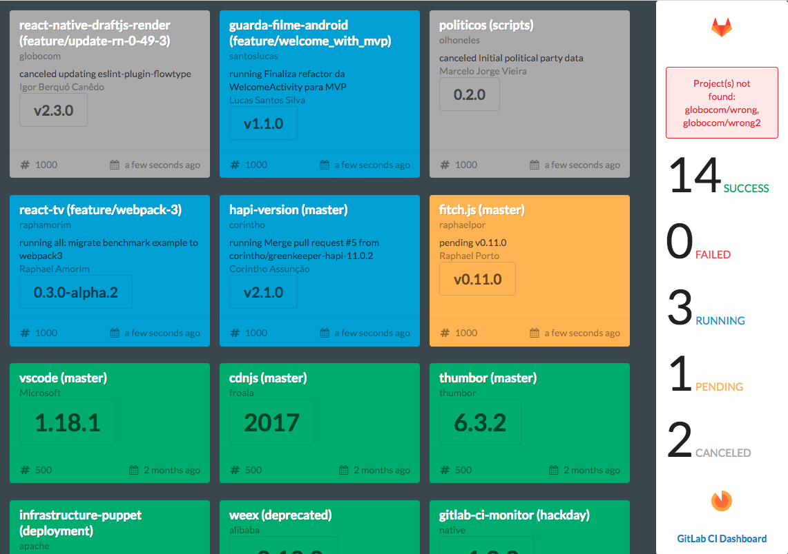

# 📊 GitLab CI Dashboard

[](https://www.npmjs.com/package/gitlab-ci-dashboard)
[](https://www.npmjs.com/package/gitlab-ci-dashboard?activeTab=versions)
[](https://www.npmjs.com/package/gitlab-ci-dashboard)
[](https://nodejs.org)
[](LICENSE)
[](https://github.com/ci-dashboard/gitlab-ci-dashboard/issues)
[](https://github.com/ci-dashboard/gitlab-ci-dashboard/actions/workflows/npm-publish.yml)

Dashboard for monitoring [GitLab CI](https://about.gitlab.com/gitlab-ci/) builds and pipelines.
Migrated in v7.0 to **React 18 + TypeScript 5 + Vite 6**.



---

## Requirements

- **Node.js** 18 or 22
- **npm** 10+

---

## Quick start

```bash
npm install
npm run dev
# → http://localhost:5173
```

Open the browser and append query parameters (see [Parameters](#parameters)):

```
http://localhost:5173/?gitlab=gitlab.example.com&token=12345&projectsFile=http://localhost:5173/static/file.json&gitlabciProtocol=http&interval=5
```

---

## GitLab support

- GitLab 8.30+ and 10.1+
- GitLab [API](https://docs.gitlab.com/ee/api/) V3 and V4

---

## Usage

The dashboard can run in two modes:

| Mode | How |
|------|-----|
| **Browser** | Open the built app with query parameters or a `?config=` URL |
| **Standalone** | Run `npm run server` with CLI flags — opens a local HTTP server automatically |

### Parameters

| Parameter | Required | Default | Description |
|-----------|----------|---------|-------------|
| `gitlab` | yes | — | GitLab server host (e.g. `gitlab.example.com`) |
| `token` | yes | — | GitLab personal access token |
| `projects` | * | — | Comma-separated list: `namespace/project:branch,...` |
| `projectsFile` | * | — | URL to a JSON file containing project list |
| `config` | * | — | URL to a full JSON config file |
| `gitlabciProtocol` | no | `https` | `http` or `https` |
| `apiVersion` | no | `3` | `3` or `4` |
| `hideSuccessCards` | no | `false` | Hide cards when they turn green |
| `hideVersion` | no | `false` | Hide version tag badge on cards |
| `interval` | no | `60` | Polling interval in seconds |
| `standalone` | no | `false` | Fetch config from server's `/params` endpoint |

\* One of `projects`, `projectsFile`, or `config` is required.

---

## Config file (JSON)

Pass `?config=<url>` to load all settings from a single JSON file:

```json
{
  "dashboard": {
    "config": {
      "gitlab": "gitlab.example.com",
      "token": "123456",
      "gitlabciProtocol": "https",
      "hideSuccessCards": false,
      "hideVersion": false,
      "interval": 60,
      "apiVersion": 3
    },
    "projects": [
      {
        "description": "My project",
        "namespace": "mygroup",
        "project": "my-project",
        "branch": "master"
      }
    ]
  }
}
```

Browser URL example:

```
http://localhost:5173/?config=http://example.com/dashboard-config.json
```

---

## Server-hosted (browser mode)

Build and copy the output to any static web server:

```bash
npm run build        # outputs to dist/
# Copy dist/ to your server
```

Then open with query params:

```
http://my-dashboard.example.com/?gitlab=gitlab.example.com&token=12345&projectsFile=http://my-dashboard.example.com/projects.json
```

---

## Standalone mode

Run a local HTTP server that serves the dashboard and exposes a `/params` endpoint
so the browser can pick up the config automatically.

**⚠️ The `/params` endpoint exposes your GitLab token — only use on private/local networks.**

```bash
# 1. Build the app first
npm run build

# 2. Start with inline parameters
npm run server -- --gitlab gitlab.example.com --token 12345 --projectsFile ./projects.json

# 3. Or use a config file
npm run server -- --config ./dashboard-config.json

# → Opens http://localhost:8081/?standalone=true automatically
```

### Server CLI options

```
--port <port>               Port (default: 8081, or $PORT)
--gitlab <host>             GitLab host (or $GITLAB)
--token <token>             GitLab token (or $TOKEN)
--config <path>             JSON config file path (or $CONFIG)
--projectsFile <path>       Path/URL to projects JSON (or $PROJECTS_FILE)
--gitlabciProtocol <proto>  http|https (default: https, or $GITLABCI_PROTOCOL)
--apiVersion <version>      3|4 (default: 3, or $API_VERSION)
--hideSuccessCards          Hide success cards (or $HIDE_SUCCESS_CARDS=true)
--hideVersion               Hide version badges (or $HIDE_VERSION=true)
--interval <seconds>        Polling interval (default: 60, or $INTERVAL)
```

All options also accept **environment variables** (shown in parentheses above).

---

## Available scripts

```bash
# Install dependencies
npm install

# Dev server with hot reload → http://localhost:5173
npm run dev

# Type-check + production build → dist/
npm run build

# Preview the production build locally
npm run preview

# Standalone server (requires a prior npm run build)
npm run server

# Run tests (Vitest)
npm run test
npm run test:watch
npm run test:coverage

# Lint (ESLint 9)
npm run lint
npm run lint:fix

# Format (Prettier)
npm run format
npm run format:check

# TypeScript type-check only
npm run typecheck
```

---

## How to develop

```bash
# Start the Vite dev server
npm run dev

# In another terminal, start the mocked GitLab CI API (optional)
npm run gitlab-mocked-server

# Open with mocked API
http://localhost:5173/?gitlab=localhost:8089&token=_&projectsFile=http://localhost:5173/static/file.json&gitlabciProtocol=http&interval=5
```

---

## Stack

| Layer | Technology |
|-------|-----------|
| UI | React 18 + TypeScript 5 |
| Build | Vite 6 + @vitejs/plugin-react-swc |
| Tests | Vitest 3 + React Testing Library 16 |
| Linting | ESLint 9 flat config + typescript-eslint |
| Formatting | Prettier 3 |
| Styles | CSS Modules + CSS custom properties |
| HTTP | native `fetch` |
| Dates | date-fns v4 |
| Versions | semver v7 |

---

## License

GitLab CI Dashboard is licensed under the [MIT license](LICENSE).

---

<p align="center">
  <a href="https://www.npmjs.com/package/gitlab-ci-dashboard">
    
  </a>
</p>
